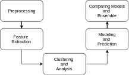

## YOUTH HAPPINESS ANALYSIS

To identify the major factors affecting
the happiness of young people and use the same to predict the happiness when the factors are known.
### Data 
[Young People Survey](https://www.kaggle.com/miroslavsabo/young-people-survey#responses.csv)

The data set at hand was formed by conducting a survey at the Comenius University in Bratislava.The individuals belonged to an age group of 15-30 years,were Slovakia Nationals.

The attributes include genre preferences in Music,Movies,Hobbies and Interests
of the individual as well as Habits and Personality based questions.

### Deployment
The file has been structured in a way to allow independent execution of different snippets of code by importing the dependencies in that particular segment itself.
A HTML document is also provided which has the entire code and the visualizations embedded.

### Prerequisites
This project has been implemented using R Studio in the form of .R and R Markdown(.Rmd) files.

Following is the description of the different packages used.
+ ##### General packages
    - *corrplot*-for plotting the correlation of attributes.
    - *ggplot2*-for visualization.
    - *dplyr*-for data manipulation.
    - *cluster*-for clustering of data.
+ ##### Data munging
  
    - *DescTools*-to find Goodman Kruskal's gamma value using GoodmanKruskalGamma().
    
+ ##### Applying clustering algorithms
    - *clue*-used for cluster ensemble.
    - *factoextra*-to extract and visualize the results of multivariate data analyses.   
    - *caret*-used for creation of predictive models.
    - *scales*-used to perform scale transformations.
    - *gridExtra*-for grid-based plots.
    - *dendextend*-for visualization and comparison of trees of hierarchical clustering.
    - *colorspace*-carries out mapping between assorted color spaces.
    - *rpart*-for recursive partitioning for classification,regression and survival trees.
    - *C50*-used for building decision trees.
    - *randomforest*-used for implementation of random forest algorithm.
    - *flexclust*-used for Kernel Canonical Correlation Analysis(KCCA).
    - *e1071*-for implementing cmeans algorithm.
  
## Flow Diagram

### Preprocessing
Preprocessing of the data has been done in **missingData_1.R**

Following are the details of the packages used:
* mice- for imputation of MCAR data points.
  
We check for missing data in the data set and conclude that the missing data is a case of MCAR(Missing Completely at Random).
Therefore we use PMM(Predictive Mean Matching) method of mice() which is suitable to impute the missing numerical values.

### Feature Extraction
The process of feature extraction involves analyzing the data
set to find the variables that should be used to classify, finding
the relevant features to be used for classification.

  
### Clustering and Analysis
Analysis of the data has been done in **happinessAnalysis.Rmd**

We have clustered and analysed the various factors which have an impact on happiness by using different clustering techniques like:
+ k-family algorithms
    - k-means
    - k-medians
    - k-medoid
+ cmeans algorithm
+ Support Vector machine
+ Decision tree
+ Pam clustering
### Modeling and Prediction

### Comparing of models and Ensemble
  
  